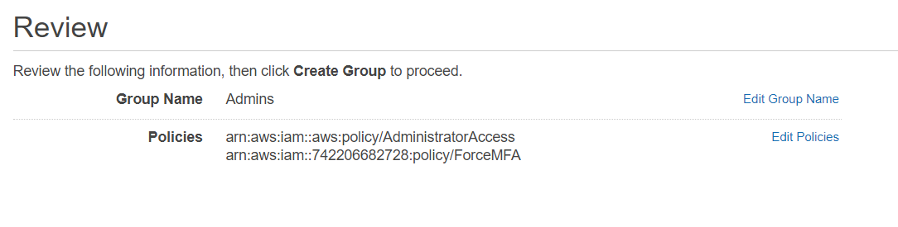

# Setup AWS 

This documentation briefly describes how to set up your AWS 
in order to use it with the project. 

**Step 2 and 3 not possible with AWS Student account!**

## 1) Force multi-factor-authentication
To increase the security of your AWS account, apply a
policy that forces every AWS IAM user to use MFA. 
- Enable MFA on your root account as well. 
- You can find a AWS policy template here: [link](./aws-policies/force-mfa.json)
- Create a group and assign the MFA policy and the administrators aws policy (see picture)



## 2) Create Admin IAM User on AWS 

- To increase the security of your root account, create an 
AWS IAM User and use this IAM account for day to day administrator 
tasks. 
- Add this account the admin group created in step 1 and give 
programmatic and console access.

## 3) Setup AWS Vault
- AWS Vault is used in this project to provide a secure AWS login environment. (Only possible with non student account!)
- You can download AWS Vault from here: [link](https://github.com/99designs/aws-vault).
- Follow the quick start instructions there to add a profile for your IAM Admin account.

## 4) Add S3 Bucket for terraform state on AWS
- Create an AWS S3 Bucket for saving terraform state.
- Choose a worldwide unique name e.g. ```lecture-devops-app-jb-tfstate```
- Launch the bucket in US-EAST-1 AWS region.

## 5) Create an AWS DynamoDB table for tf state locking
- Create a table within DynamoDB for terraform state locking.
- Name the table: ```lecture-devops-app-tfstate-lock```
- Primary key: ```LockID```
- This will prevent conflicts if terraform runs in parallel (e.g. from your computer and CI/CD pipeline).

## 6) Create an ECR Repos for the lecture-app and lecture-app-db
- Create an ECR Repo called ```lecture-devops-app-server```
- Enable ```scan on push```
- Disable ```Tag immutability```
- This ECR will store builds of the todo-app server 
  - builds come from production and staging environment
  - builds are tagged with git commit SHA and also latest (for latest build)

<hr/>

- Create an ECR Repo called ```lecture-devops-app-db```
- Enable ```scan on push```
- Disable ```Tag immutability```
- This ECR will store builds of the todo-app mongodb container
- - builds come from production and staging environment
- - builds are tagged with git commit SHA and also latest (for latest build)
## 7) Create Policy for CI IAM User
- This Policy is for a user that gets programmatic access to AWS 
- GitLab is using this IAM user with this policy to
  - run Terraform (apply changes to environments)
  - push app artifacts (builds) of our project to AWS ECR

- For security reasons CI account is limited to only needed access rights
  - A template aws security policy can be found here [app-terraform-ci-user.json](../doc/aws-policies/app-terraform-ci-user.json)
    - Replace every `${PUT_IN_UNIQUE_S3_BUCKET_NAME}` with the S3 Bucket name created in Step 4).
    - Replace every `${PUT_IN_DYNAMODB_NAME}` with the AWS DynamoDB table name created in Step 5).
  - CI user can fully access AWS EC2 but:
  - CI user cant create AWS EC2 resources greater than t2.micro 
  - CI user can access ECR repositories created in Step 6)
  - CI user can read and update the Terraform lock state in AWS dynamodb created in Step 5

- Head over to your AWS Console -> IAM -> Policies -> Create Policy
- Choose JSON Tab and paste in content of [app-terraform-ci-user.json](../doc/aws-policies/app-terraform-ci-user.json) 
  - with your replaced data! (see above).
- Review your Policy and give it a name like "lecture-devOps-ci" and optional a description like "Policy for lecture-devops-app CI user".
- Create the policy
  
## 8) Create CI IAM User in AWS

**WARNING!**: It is not possible to create IAM users with access keys on an AWS Educate Account. <br/>
**You can skip this step and unfortunately you have to use your AWS main account** <br/>
Unfortunately you have to re-set your AWS Access Key in GitLab every time it got refreshed. <br/>
This is tedious but no other solution possible on AWS Educate.

- This creates a IAM User for GitLab CI that is using the policy created in Step 7)
- Head over to your AWS Console -> IAM -> Users -> Create User
- Name the user "lecture-devops-app-ci" and give it only programmatic access.
- Next choose "Attach existing policies directly"
- Set filter to "custom managed"
- Select "lecture-devOps-ci" policy
- Review your settings and create user
  
## 9) Add SSH key to AWS
In order to access the bastion server (which is a linux running virtual machine)
you need to add your public ssh-key to AWS. 

- Create an SSH-Key (if not already done)
- Output your **public** SSH-Key via `$ cat ~/.ssh/id_rsa.pub`
- Go to AWS Console -> EC2 -> Network & Security -> Key Pairs [short link](https://console.aws.amazon.com/ec2/v2/home?region=us-east-1#KeyPairs:)
- Click import key on the right hand top side
- Name the key pair `lda-app-devops-bastion`
- Input your **public** SSH-Key in the input field
## 10) Add ECR Image URLs to terraform config
Terraform needs to know the exact URL to your AWS ECR that is holding
the built server image (including the client part). 

- Open up AWS console and go to ECR -> Amazon ECR -> repositories
- Copy the URI of "lecture-devops-app-server"
- Paste the value in [variables.tf](../deploy/variables.tf) like this 
  - variable "ecr_image_server"
  - default=${YOUR_ECR_URI}:latest
- Copy the URI of "lecture-devops-app-db"
- Paste the value in [variables.tf](../deploy/variables.tf) like this 
  - variable "ecr_image_db"
  - default=${YOUR_ECR_URI}:latest
- *Hint*: These get overwritten during CI/CD jobs because there we use the specific build that is tagged by the git short SHA.
  - But for deploying from a developers machine oder from bastion server we have default value pointing to the latest tag.

### Continue with terraform setup
[go to terraform setup documentation](./setup-terraform.md)
