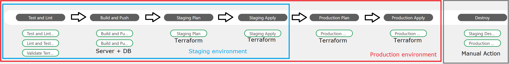
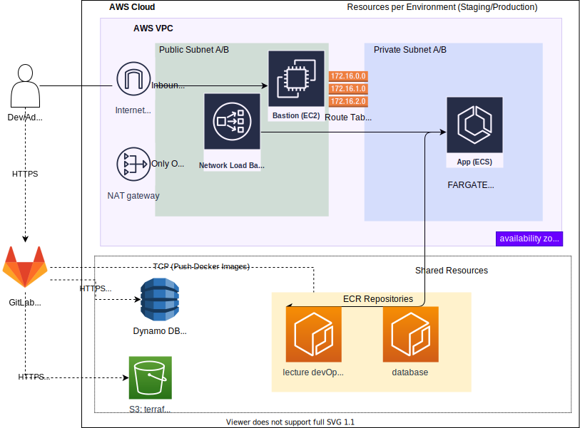

# DevOps Concept

- [DevOps Concept](#devops-concept)
  - [Overall Idea](#overall-idea)
  - [Environments](#environments)
    - [Local 0](#local-0)
      - [Description](#description)
      - [Pipeline](#pipeline)
    - [Staging 1](#staging-1)
      - [Description](#description-1)
      - [Pipeline](#pipeline-1)
    - [Production 2](#production-2)
      - [Description](#description-2)
      - [Pipeline](#pipeline-2)
  - [Lifecyle (Automation Steps)](#lifecyle-automation-steps)
    - [Pipeline Stages:](#pipeline-stages)
      - [1: Test and Lint](#1-test-and-lint)
      - [2: Build and Push](#2-build-and-push)
      - [3: Staging Plan / Production Plan](#3-staging-plan--production-plan)
      - [4: Staging Apply / Production Apply](#4-staging-apply--production-apply)
      - [5: Destroy (Manual)](#5-destroy-manual)
  - [Architecture](#architecture)
    - [Load Balancer](#load-balancer)
    - [Database](#database)
    - [Container Engine](#container-engine)
    - [Network](#network)
    - [Provisioning](#provisioning)
  - [Technology](#technology)
    - [Version Control System](#version-control-system)
    - [App insights (metrics etc)](#app-insights-metrics-etc)
    - [Command automation](#command-automation)
    - [Container Orchestration](#container-orchestration)
    - [CI/CD](#cicd)
    - [Cloud](#cloud)
    - [NGINX](#nginx)
    - [Security](#security)
    - [Needed installed tools](#needed-installed-tools)
    - [Automated Tool installation](#automated-tool-installation)
  
**DevOps - Software Development and Operations (WiSe2021) @Beuth Hochschule**

Welcome to the concept of this devOps concept. <br/>

This concept describes the infrastructure, allocation of resources, version control system in use and more.
For more information regarding the app to automate, please take a look into its [README](../app/README.md).


## Overall Idea

The overall idea is to automate as much as possible regarding 
- local development including
  - spin up the application locally
  - building, testing, provisioning
- allocate resources in an cloud environment to
  - serving the app in public internet
    - in two separated and isolated environments for production and testing new features (staging)

The main focus is on following the infrastructure-as-code (IaC) paradigm. This is done by using 
[HashiCorp Terraform](https://www.terraform.io/) strictly to manage cloud services. 
Terraform is used on a developers machine, on bastion servers in the cloud and in CI/CD pipelines.
[Git](https://git.com/) and [GitLab](https://gitlab.com) is in place as Version Control System (VCS).
[GitLabCI](https://docs.gitlab.com/ee/ci/) is the chosen tool for
- Continuous Integration (CI)
- Continuous Delivery (CD)
- Continuous Deployment (CD)

For building, archiving and serving the application (means server with client + database), 
the whole application gets containerized in OCI-Containers builds, tagged and pushed to repositories 
(that is holding different versions coupled with git commit short-SHA) by [Docker](https://docker.io)
The choice for containers over virtual machines or running the code directly is emphasized with
- Containers are lightweight
- Less depending on the running infrastructure
- Easier to manage

For provisioning the project is utilizing AWS Cloudwatch through a bastion server
- Alongside with prometheus (WIP)
- The running app itself is offering a `/status` endpoint (secured) for provisioning


## Environments

There are three environments. Each one is targeting 
a different purpose within the project. 

Briefly:

- Local 0: local development environment on a developers machine
- - Infrastructure runs in containers

- Staging 1: cloud development environment for new features and (hot) fixes
- - Managed by Terraform (via Terraform Workspace)
- - Git Branch Master -> AWS Staging Environment

- Production 2: cloud development environment for new new production builds.
- - Managed by Terraform (via Terraform Workspace)
- - Git Branch Production -> AWS Production Environment

Each Cloud Environment (No. 1 and No. 2) has a Bastion Server.
This Bastion Server is for connecting into the private network part of the
environment (inside AWS) for administration purposes. This is a small 
linux running machine of a small type (t2.micro). 

### Local 0

#### Description

This one aims to establish a reliable local development environment on a developers machine. 

- All infrastructure and resources gets allocated locally via Docker/Docker-compose.

- There are 3 `.env` - files:
  - app-container-dev.env => This gets forwarded into the running development container of the server (including client).
  - app-db-container-dev.env => This gets forwarded into the running mongodb database container.
  - .env => variables set here get used by docker-compose to create dev (server/db) with set configuration
#### Pipeline

**Trigger**: Manual CLI Commands / no strict order

1. Run Linting 
2. Build
3. Run Tests
4. Allocate infrastructure locally via containers

App is reachable via dev server running on localhost:3000

### Staging 1 
#### Description
- This environment is allocated and set up in an AWS cloud environment (VPC). 
- New features and (hot) fixes can get tested here. 

**Trigger**: Merge or Commit into Branch "Master" 
- Master branch is protected on GitLab
  - Only Maintainer can commit directly


#### Pipeline

1. Run Linting / Testing <br />
**If successful**: 
2. Run Terraform format and validation
**If successful**: 
3. Build Artifact
4. Push Artifact to Amazon ECR with tag ```$ECR_REPO:$CI_COMMIT_SHORT_SHA```
5. Plan Staging (Terraform) <br />
If successful:
6. Apply Staging (Terraform)


- App running in staging environment accessible via FQDN (Terraform Apply output)
- Bastion Server running in staging environment accessible via FQDN (Terraform Apply output)
  - See result of terraform Apply job for getting these information

### Production 2
#### Description
- This environment is allocated and set up in an AWS cloud environment (VPC). 
- App is served here as production release 

**Trigger**: Merge or Commit into Branch "Production" 

- This environment is allocated in an AWS cloud environment.
- New Builds get deployed here.
- Every Artifact that goes into production goes also to staging.
- => staging will at least always have latest production artifact.

- Access is maybe restricted to developers and stakeholders.

#### Pipeline

1. Run Linting / Testing <br />
**If successful**: 
2. Run Terraform format and validation
**If successful**: 
3. Build Artifact
4. Push Artifact to Amazon ECR with tag ```$ECR_REPO:$CI_COMMIT_SHORT_SHA```
5. Plan Production (Terraform) <br />
If successful:
6. Apply Production (Terraform)


- App running in production environment accessible via FQDN (Terraform output)
- Bastion Server running in production environment accessible via FQDN (Terraform output)
  - See result of terraform Apply job for getting these information

## Lifecyle (Automation Steps)

This project is using GitLab CI/CD system. <br/>
See [GitLabCI Configuration](../.gitlab-ci.yml). <br/>
<hr>
Policy: <br/>
CI/CD gets only triggered by Merge Requests or Commits into Branch Master (Staging environment) or Production. <br/>
CI/CD doesn't get triggered by Merges or Commits into other Branches. <br>

### Pipeline Stages:

In general: <br/>
- Every merge request into the environment branches (master = staging env., production = production env.) will trigger the __Test and Lint__ stage. Here we test and lint the code of the server and client part with a job. 
- We also validating/linting every changes to the Terraform configuration with a job. 
- On success we can then merge our changes into master or production branch
- This creates a new commit there and therefore __Build and Push__ stage gets triggered.
  - Job: We build the Artifact of the Server (including the Client part)
  - Job: We Push the Artifact to AWS ECR

- When then plan every changes (if any) to the staging and/or production environment managed by Terraform in __Staging Plan__ / __Production Plan__ stage with a job.
- If successful we apply every changes (if any) to the staging and production environment managed by Terraform in __Staging Apply__ / __Production Apply__ stage with a job.
- _Info_ Every terraform changes that get applied to the production environment will be applied to the staging environment as well. 
- **This gets done before the production apply gets done**
- BUT NEVER vice versa! This is a project policy.
- The *Production Apply* Terraform job can also get set to manual to increase security (but loosing some automation).
  - If set manual: Every merge into production branch gets applied on staging environment automatically. Then if tested we can trigger the production apply.

- __Destroy Stage__, this Job can get triggered manually via GitLab to destroy the whole production or staging environment on AWS via Terraform.


There are 5 stages in the pipeline in total:

Test and Lint -> Build and Push -> Staging _or_ Production Plan -> Staging _or_ Production Apply -> Destroy (Manual Trigger) (staging _or_ production environment)



#### 1: Test and Lint

_Triggered by_ : Merge Request or Commit -> __Master__ or __Production__ <br/>
Hint: Master branch = Staging environment 

- Test and Lint Server and Client part
- Validate Terraform Configuration

#### 2: Build and Push

_Triggered by_ : Commit -> __Master__ or __Production__ <br/>
Hint: Master branch = Staging environment <br/>
We only want to Build and Push artifacts that survived test and lint.
Therefore only Build and Push after a merge request gets merged in ( = commit) -> No build and push on merge request creation!

- Build Server Part (including Client as static served artifact)
- Build DB Image
- __if successful__ : Push both to AWS ECR Repositories

#### 3: Staging Plan / Production Plan

_Triggered by_ : Commit -> __Master__ or __Production__ <br/>
Hint: Master branch = Staging environment.

- After successful _Test and Lint_ stage that is validating Terraform code (beside test/lint Server/Client part). 
- Plan changes to Staging environment with terraform.

#### 4: Staging Apply / Production Apply

_Triggered by_ : Commit -> __Master__ or __Production__ <br/>
Hint: Master branch = Staging environment.

- After successful _Test and Lint_ stage that is validating Terraform code. 
- Plan changes to Staging environment with terraform.

#### 5: Destroy (Manual)

_Triggered by_ : Commit -> __Production__ <br/>

- Destroying entire staging or production environment in AWS manually with terraform via GitLab CI/CD pipeline.

## Architecture



<br/>

### Load Balancer 

- A load balancer is handling incoming requests on staging and production environment (not on local dev environment)
- The load balancer is listening on http port and forwards the traffic to the ECS services which is running app & db via containers.
- Health checks getting performed on the entry path of the app-server `"/"`.
  - If the status is unhealthy (detected by non satisfying http status code response)
    - Load balancer informs ECS services about the outage (ECS will try to reload the service)
    - Fallback to another availability zone (1 or 2 in us-east-1)
### Database 

- The project needs a documented orientated ('noSQL') database like MongoDB.
- On local development (Environment 0) a MongoDB version 4.2.6 is running in a Docker Container. 
  - automatically provided by Docker-Compose (see [docker-compose.yml](../docker-compose.yml)).

- ~~In staging and production environment (managed by terraform) an AWS documented-db cluster gets allocated~~
  -~~ Per environment one doc-db-cluster having one doc-db-instance per availability zone (A,B)~~
  - ~~Hence, one cluster with 2 instances~~
- Instead of utilizing AWS documentDB for persistence, fallback to a simpler solution:
  - a second container gets build and push to its one AWS ECR Repo (lecture-devops-app-db)
  - Server and DB container running within the same AWS FARGATE Task (replica desired count = 2)
- Why this change?
  - Configuration in cloud environments (stag./prod.) are almost the same like in local-dev environment
  - for the sake of the KISS principal
  - AWS DocumentDB takes a very long time to spin up
    - This is annoying and tedious with session time limited AWS Educate Account
  - Connection frustrating errors while try to connect from server container to AWS documentDB Cluster

### Container Engine

- The project is fully containerized
  - In other words: the server runs in a single container
  - The client side gets build and pushed to the server container as artifact
  - At runtime the client gets dispatched to the visiting users web-browser as static files
  - client does requests to the server

- On a local dev setup:
  - With docker compose build:
    - Build Client artifact
    - Transfer Client artifact to server build
    - Build server including client artifact
  - With docker compose up
    - Run server container (serve client on request)
    - Run MongoDB container as local dev database

  - Run tests on client and server automatically with docker compose
    - All will run within containers

- On Cloud Setup (Environments staging and production)
  - AWS ECS with AWS Fargate in use to:
    - Spin up built containers pulled from AWS ECR
    - ECR contains a build from every commit (normally made by a merge request) 
      - that was made into master (representing staging environment) and production branch
    - ~~The running app container(s) within an ECS Task are using the AWS documented-db cluster described before as db backend~~
    - App DB is running as container in ECS Fargate
    - Set desired replicas of services in [ecs.tf => aws_ecs_service" "server"](../deploy/ecs.tf)
  - Update Strategy: In-Place with zero downtime

### Network 

- Each environment (staging and production) is divided up into one public and one private reachable part 
represented by subnets.
  - Public Subnet A (running in availability zone A):   10.1.1.0/24
  - Private Subnet A (running in availability zone A):  10.1.10.0/24
  - Public Subnet B (running availability zone B):      10.1.2.0/24
  - Private Subnet B (running in availability zone B):  10.1.11.0/24
- Terraform will create a whole VPC on AWS with described network for each environment
    
- The running app itself (server part that also serves the client to a visitors browser) is set up in the private subnet of each environment.
- On the public subnet there is a public reachable (but ssh-key secured) bastion server for performing administration task within the environment.
  - e.g. checking out metrics and logs etc. 
- A public accessible load balancer is on the public subnet as well. 
  - Load balancer is listening on ports 80 (http) and 443 (https)
  - A visitors request gets forwarded to the app running in private subnet
  - Only load balancer can access the app server container from public Internet (besides bastion server)
- the database is located in the private part of each environment because there is no need for direct public access to the db.
- an AWS Internet Gateway is controlling inbound and outbound access to the app and the bastion server.
- (there is also an AWS NAT Gateway acting as emergency exit for outbound traffic only for the private subnets).
  - So containers can perform updates on port 443 for example
- The traffic between Public and Private subnets is managed by a route table.
  
- The network is set up to make use of AWS availability zones in the running AWS region
  - This is done by creating the subnets (public/private) twice, hence in availability zone A and B of the AWS region.
  - This means if availability zone A goes down, zone B can take over and prevent an outage.
  - This also necessary for AWS load balancer in order do its job. 

### Provisioning

- AWS CloudWatch (merging multiple log streams)
- Prometheus 

All via bastion server (one each per environment [staging/production])

## Technology
This sections briefly describes technology (software, etc.) 
that is used within the project and the targeting environments.
### Version Control System

- Git
- Following the Git Flow Pattern.
  - Create Branches for
    - feature/new-feature
    - hotfix/new-hotfix
  - Merge Request Creation into master || production branch triggers CI/CD Pipeline

### App insights (metrics etc)
- https://prometheus.io/ for metrics (insights)
- or https://github.com/cloudquery/cloudquery ?

### Command automation 
- Make (makefile)
  - see the [Makefile](../Makefile) for common project commands and tasks
- System (ps1 script and sh script)
  - see [deploy/tools](../deploy/tools)
    - Script for conveniently set AWS Access data (useful for Educate Account)

### Container Orchestration
- Docker
- Docker Compose
- Amazon ECS (for running app containers)
  - AWS Fargate (serverless) Engine Runtime
  - Configuration see [ecs.tf](../deploy/ecs.tf)


### CI/CD

- GitLab CI/CD
- Configuration can be found in [.gitlab-ci.yml](../.gitlab-ci.yml)
- Using docker-in-docker (dind) for
  - build
  - push
  - Server and Database Container to AWS ECR
- Run testing and lint + terraform jobs

### Cloud
- Amazon Web Services (AWS)
- Terraform to manage resources in the cloud
  - Amazon S3 Bucket to version terraform state
  - Amazon DynamoDB Table to lock terraform state
- Amazon EC2 for Bastion Server (each per Cloud Environment)
- Amazon ECS for Container Orchestration
- Amazon ECR for Container Registration and Archiving
- Amazon VPC for managing environments
- Amazon ELB for load-balancing inbound traffic across two availability zones (per Environment) and all running ECS Task Replicas
- Amazon CloudWatch for provisioning log streams and more
- ~~Amazon DocumentDB (for running MongoDB like Database)~~

### NGINX
- **WIP**: As reverse Proxy between Internet inbound access between Load balancer and actual service (ECS)
  
### Security

- AWS-Vault to keep credentials encrypted with forced MFA policy on AWS (not compatible with AWS Educate account)
  - AWS-Vault generated temporarily access tokens get passed via environments variables if needed
- AWS Cloud is set up in a way that ensures that
  - Network access to a resource is limited to the fewest necessary
  - IAM User for CI task is restricted with policy to only access and performing really needed actions
  - Non-root IAM User for doing day-to-day administration tasks (not possible with Educate Account)  


### Needed installed tools 

To keep the needed installed tools on a developers machine at a minimum,
most of the tools get executed by disposable one-time containers. 
<br/>
A DevOp/Maintainer/Developer only needs

- Git
- Docker
- Docker-Compose
- (Make)
  
locally installed on the machine.

### Automated Tool installation 
- The idea here is to provide scripts to 
  - automatically installing  all needed tools on a (new) developers machine to
  - to manage the project.
Solution with:
- MS Windows: Powershell Script (ps1)
  - Chocolatey
- Apple Mac || Linux: shell script (sh)
  - Brew
  - Brew Cask
  - apt / yum / ...


