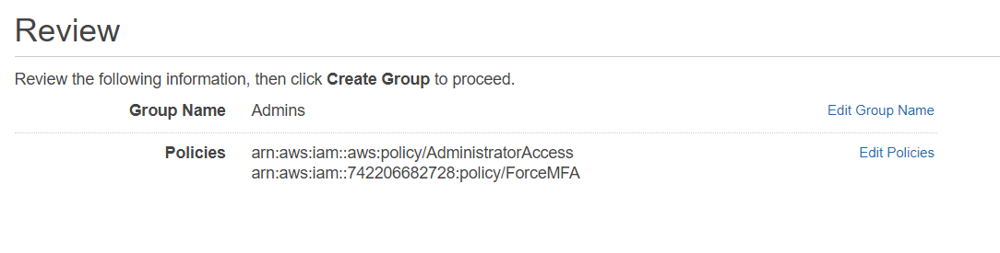

# Setup AWS 

This documentation briefly describes how to set up your AWS 
in order to use it with the project. 

**Step 2 and 3 not possible with AWS Student account!**

## 1) Force multi-factor-authentication
To increase the security of your AWS account, apply a
policy that forces every AWS IAM user to use MFA. 
- Enable MFA on your root account as well. 
- You can find a AWS policy template here: [link](./aws-policies/force-mfa.json)
- Create a group and assign the MFA policy and the administrators aws policy (see picture)



## 2) Create Admin IAM User on AWS 

- To increase the security of your root account, create an 
AWS IAM User and use this IAM account for day to day administrator 
tasks. 
- Add this account the admin group created in step 1 and give 
programmatic and console access.

## 3) Setup AWS Vault
- AWS Vault is used in this project to provide a secure AWS login environment. (Only possible with non student account!)
- You can download AWS Vault from here: [link](https://github.com/99designs/aws-vault).
- Follow the quick start instructions there to add a profile for your IAM Admin account.

## 4) Add S3 Bucket for terraform state on AWS
- Create an AWS S3 Bucket for saving terraform state.
- Choose a worldwide unique name e.g. ```lecture-devops-app-jb-tfstate```
- Launch the bucket in US-EAST-1 AWS region.

## 5) Create an AWS DynamoDB table for tf state locking
- Create a table within DynamoDB for terraform state locking.
- Name the table: ```lecture-devops-app-tfstate-lock```
- Primary key: ```LockID```
- This will prevent conflicts if terraform runs in parallel (e.g. from your computer and CI/CD pipeline).

## 6) Create an ECR Repo for the lecture-app
- Create an ECR Repo called ```lecture-devops-app-server```
- Enable ```scan on push```
- Disable ```Tag immutability```
- This ECR will store builds of the todo-app server 
- - builds come from production and staging environment
- - builds are tagged with git commit SHA and also latest (for latest build)